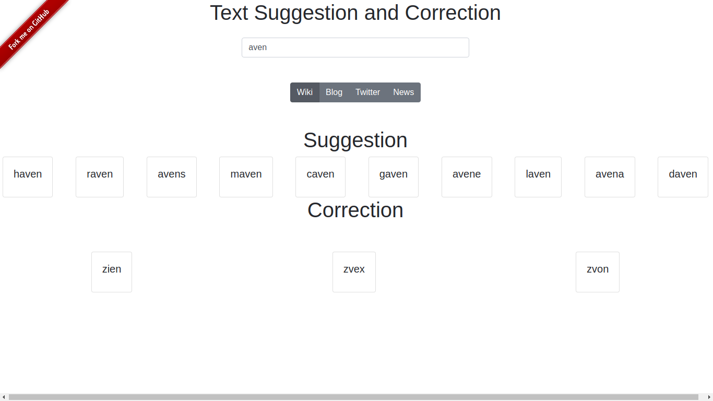

# IR Project

# Text Suggestion and Correction

This repository contains the code for IR Course project for 2018 Fall.


## Installation

0. The program requires python to run
1. Install required libraries by
```bash
pip install -r requirements.txt
```
2. Put the required files to be indexed in the [Files](webapp/Files) folder
3. Run the initial indexing and server using
```bash
./manage.py makemigrations app
./manage.py migrate
./manage.py runserver
```
4. To reindex, delete the files in the [indexes](webapp/indexes)

## Advanced
- In [setting.py](webapp/webapp/settings.py), you can put custom settings to `WHOOSH_` variables to change path, index names and schema

# Contributor
### SeniorOnly

1. [Sunil Kumar B](https://github.com/sunil006) S20150010006
2. [Shyam Sunder](https://github.com/shyamsunder007) S20150010037
3. [Vaishnav Murali](https://github.com/vaishnavm217) S20150010054
